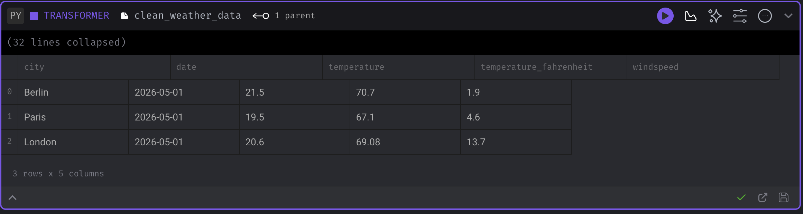

# Mage AI - Individual Tool Presentation
**Tool:** Mage AI (#55)
**Category:** Airflow / Orchestration

## 1. What is this tool?
Mage AI is an open-source data pipeline tool for transforming and integrating data. It provides an interactive, Jupyter-style notebook interface for building data pipelines, making it a modern and accessible alternative to Apache Airflow. Pipelines are built using reusable, modular blocks of code (Data Loaders, Transformers, Data Exporters) and can mix Python, SQL, and R.

## 2. Prerequisites
- **OS**: Windows (via WSL2), macOS, or Linux
- **Docker**: Docker Desktop (v24.0 or higher) and Docker Compose
- **Python**: Python 3.9+ (if running scripts locally outside Docker)

## 3. Installation
To set up the environment, clone this repository and navigate to its directory:
```bash
git clone https://github.com/rafi-abdurrahman/yzv_322e_mage_ai_presentation.git
cd mage-ai-demo
```

Run the following command to pull the Mage AI and PostgreSQL images and start the containers:
```bash
docker compose up -d
```

This will automatically start the Mage AI server and a PostgreSQL database. The `demo_project` directory is mounted into the Mage container so all pipeline code is saved locally.

## 4. Running the Example
1. Open your web browser and go to: `http://localhost:6789`
2. You will see the Mage AI dashboard. Navigate to **Pipelines** in the left sidebar.
3. Click on the `weather_etl` pipeline.
4. To run the entire pipeline, click the **Run pipeline now** button at the top right of the screen.
5. Alternatively, click on **Edit pipeline** to view the interactive notebook. Run each block individually by clicking the Play icon (▶) on each block:
   - Run the `load_weather_api` Data Loader block to fetch data from the Open-Meteo API.
   - Run the `clean_weather_data` Transformer block to format dates and convert Celsius to Fahrenheit.
   - Run the `export_weather_postgres` Data Exporter block to insert the cleaned data into the local PostgreSQL database table `weather_data`.

## 5. Visualizing the Data in Mage AI
Mage AI has built-in charting capabilities. To visualize your data:
1. In the pipeline notebook view, hover just below the `clean_weather_data` Transformer block and click **`+ Chart`**.
2. Select **Bar chart** from the configuration panel on the right.
3. Click the **edit** icon at the top right of the new chart block to edit the underlying Python code.
4. Replace the default code with the following snippet to aggregate and plot the average temperature per city:

   ```python
   import pandas as pd

   # Ensure df_1 is extracted if Mage wraps it in a list
   df_1 = df_1[0] if isinstance(df_1, list) else df_1

   df_1["temperature"] = pd.to_numeric(df_1["temperature"], errors="coerce")

   avg_temp = (
       df_1
       .dropna(subset=["city", "temperature"])
       .groupby("city", as_index=False)["temperature"]
       .mean()
   )

   x = avg_temp["city"].tolist()
   y = [avg_temp["temperature"].round(2).tolist()]
   ```

5. Click the **Play (▶)** button on the chart. You can now view the temperature distribution directly within your pipeline interface!

## 6. Expected Output
When the pipeline runs successfully, data is loaded into the PostgreSQL database. You can also view the data interactively through the pipeline notebook and the newly created Bar Chart.




## 7. AI Usage Disclosure
This presentation and repository were developed with the assistance of an AI coding assistant (Gemini/Antigravity) to help structure the Docker environment (including the PostgreSQL integration), formulate the ETL pipeline code, and structure this README according to the assignment requirements. All AI-generated outputs were reviewed and tested by the student before submission.
